# Architecture Diagrams

These diagrams are in Mermaid format, which GitHub renders automatically.

---

## 1. Three-Layer Architecture

```mermaid
flowchart TB
    subgraph Layer1["Layer 1: Project MD (Bootstrap)"]
        MD["📄 Project Description<br/>~10 lines<br/>Acts as BIOS"]
    end
    
    subgraph Layer2["Layer 2: SKILL.md (Permanent)"]
        SKILL["📚 Permanent Knowledge<br/>~900 lines<br/>Acts as Hard Drive"]
    end
    
    subgraph Layer3["Layer 3: RAG (Rotational)"]
        RAG["💾 Working Memory<br/>Current exercise only<br/>Acts as RAM"]
    end
    
    MD -->|"Auto-triggers"| SKILL
    SKILL -->|"Provides context"| RAG
    RAG -->|"Concepts consolidated"| SKILL
    
    style Layer1 fill:#e1f5fe,stroke:#01579b
    style Layer2 fill:#fff3e0,stroke:#e65100
    style Layer3 fill:#f3e5f5,stroke:#7b1fa2
```

---

## 2. RAG Rotation Cycle

```mermaid
flowchart LR
    subgraph Cycle["RAG Rotation Cycle"]
        A["📥 LOAD<br/>Exercise into RAG"] --> B["🎓 WORK<br/>Socratic method"]
        B --> C["📝 DOCUMENT<br/>Create MD summary"]
        C --> D["🔄 CONSOLIDATE<br/>Extract → Skill"]
        D --> E["🗑️ CLEAR<br/>Empty RAG"]
        E --> A
    end
    
    subgraph Permanent["Permanent Storage"]
        SKILL2["📚 SKILL.md<br/>Grows slowly<br/>Only key concepts"]
    end
    
    D -.->|"Key concepts"| SKILL2
    
    style Cycle fill:#e8f5e9,stroke:#2e7d32
    style Permanent fill:#fff3e0,stroke:#e65100
```

---

## 3. Human-as-Firewall Security

```mermaid
flowchart LR
    subgraph Local["🏠 Local (Temporary)"]
        CC["Claude Code<br/>Raw content<br/>PDFs, notes"]
    end
    
    subgraph Firewall["🛡️ Human Firewall"]
        H["👤 HUMAN<br/>Reviews<br/>Sanitizes<br/>Curates"]
    end
    
    subgraph Cloud["☁️ Anthropic Cloud (Permanent)"]
        AC["Skill Storage<br/>Clean concepts<br/>No PII"]
    end
    
    CC -->|"Raw data"| H
    H -->|"Curated content"| AC
    
    style Local fill:#ffebee,stroke:#c62828
    style Firewall fill:#fff9c4,stroke:#f9a825
    style Cloud fill:#e3f2fd,stroke:#1565c0
```

---

## 4. Three-Tier Synchronization

```mermaid
flowchart TB
    subgraph Tier1["Tier 1: External Drive"]
        T1["📁 Main Workspace<br/>/Volumes/Drive/SKILLS/<br/>All edits happen here"]
    end
    
    subgraph Tier2["Tier 2: Claude Code"]
        T2["📁 ~/.claude/skills/<br/>SKILL.md + references/<br/>Claude Code reads here"]
    end
    
    subgraph Tier3["Tier 3: Claude Desktop"]
        T3["☁️ Anthropic Servers<br/>ZIP uploaded manually<br/>Settings > Capabilities"]
    end
    
    T1 -->|"cp SKILL.md + refs/"| T2
    T2 -->|"zip → upload"| T3
    
    style Tier1 fill:#e8f5e9,stroke:#2e7d32
    style Tier2 fill:#fff3e0,stroke:#e65100
    style Tier3 fill:#e3f2fd,stroke:#1565c0
```

---

## 5. Before vs After Comparison

```mermaid
flowchart LR
    subgraph Before["❌ BEFORE: RAG-Only"]
        B1["Month 1-6: Works"] --> B2["Month 7-9: Degrades"]
        B2 --> B3["Month 10: Unusable"]
        B3 --> B4["60% failures<br/>Constant compaction<br/>Lost context"]
    end
    
    subgraph After["✅ AFTER: Layered"]
        A1["Layer 1: Bootstrap"] --> A2["Layer 2: Permanent"]
        A2 --> A3["Layer 3: Rotational"]
        A3 --> A4["0% failures<br/>Rare compaction<br/>Full control"]
    end
    
    style Before fill:#ffebee,stroke:#c62828
    style After fill:#e8f5e9,stroke:#2e7d32
```

---

## Usage

These diagrams render automatically on GitHub. To use elsewhere:

1. **GitHub**: Just paste the Mermaid code in any `.md` file
2. **Other sites**: Use [Mermaid Live Editor](https://mermaid.live/) to export as PNG/SVG
3. **Local**: Install Mermaid CLI or use VS Code extension
